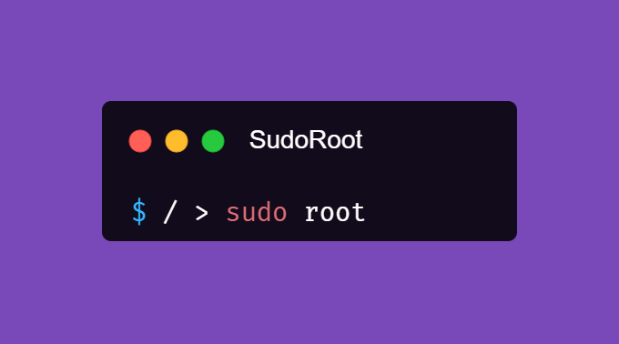
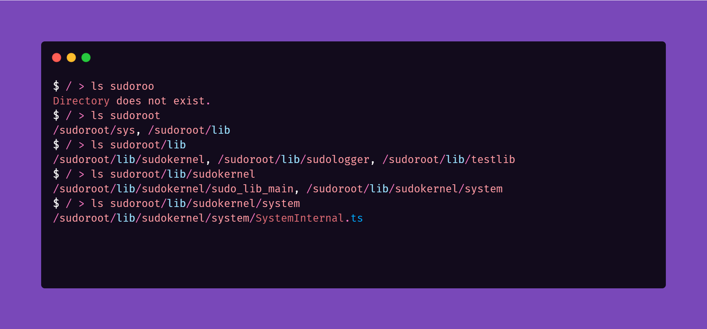

<h1></h1>
<h1 align="center"> SudoRoot </h1>

a Operating System like feeling in javascript using typescript and ts-node.

**Disclaimer**: The VFS stores files in memory and not on the computer, if you turn off or close out of SudoRoot then your data will be lost and is not saved. You can follow the wiki on how to make this data saved constantly when you open SudoRoot.

## How does this work?
We use a virtual file system by using **memfs** which makes it so easy for me to work around with memory filesystem instead with regular filesystem.

The vm folder (Virtual Machine Folder) contains all the preloaded files so when you run the system it get's copied from that folder to the VFS.

Once that's copied you'd have premade commands built in the system to give a feeling of linux commands like: **ls**, **cd**, **cwd** (changed from pwd), **mkdir**, **rmdir**, **echo**, and so on.

## Maintained?
Yes this project would be maintained only if in somecases that I have to do something which would make me not work on this project for some days.

## Documentation or Tutorial?
You can use the wiki to know how to use this system.

## Images?
Here is one cool image of the terminal:  

## License and Author
This project is maintained and authored by Max Jackson and it's licesensed under **MIT** license.
